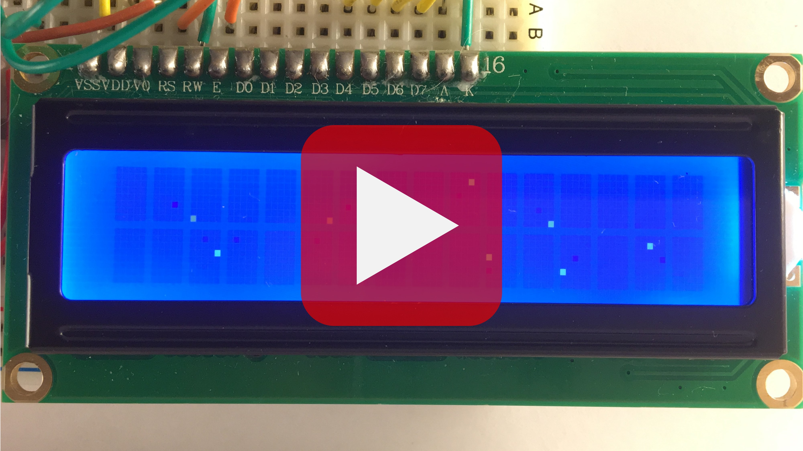
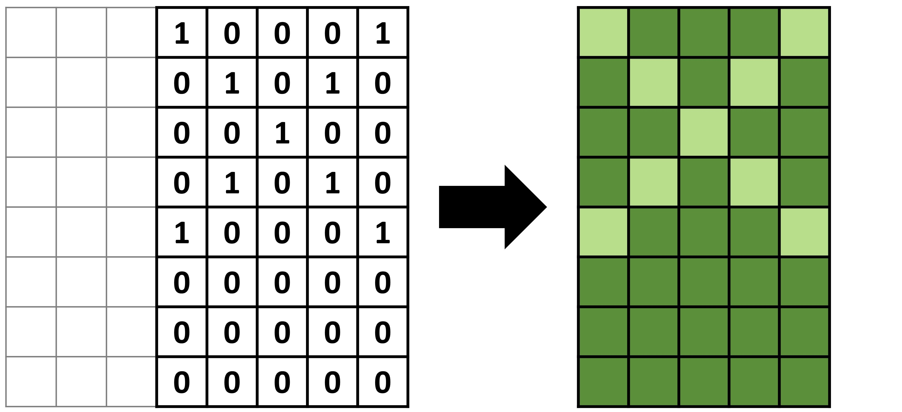
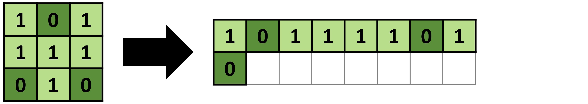
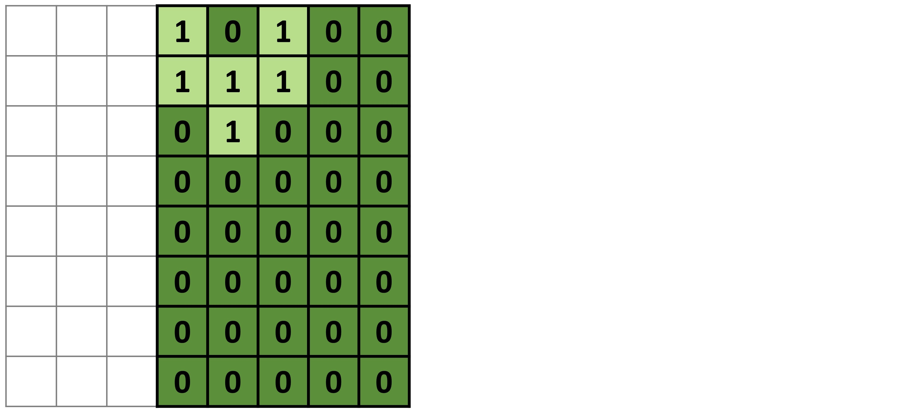
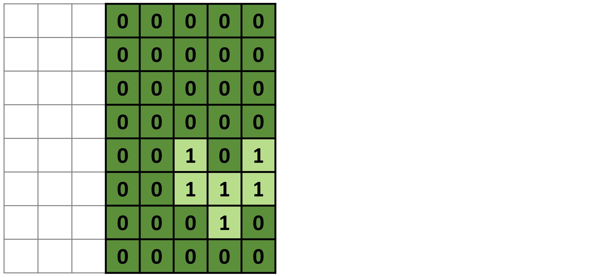
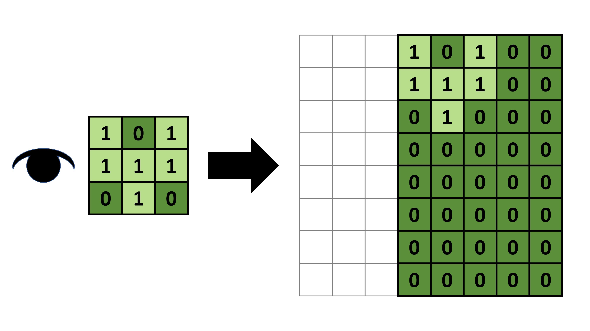
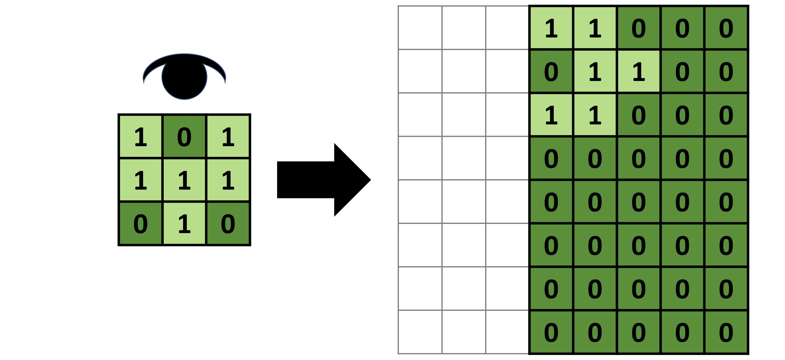

# LCD-Animation-Library

## Table of Contents
- [Description](#Description)
- [How it Works](#How-it-Works)
- [Prerequisites](#Prerequisites)
- [How to Use](#How-to-Use)
    - [Quick Reference Guide](#Quick-Reference-Guide)
    - [Installation](#Installation)
    - [Wiring the LCD](#Wiring-the-LCD)
    - [Creating Your Animation](#Creating-Your-Animation)
- [FAQ](#FAQ)
- [Helpful Links](#Helpful-Links)

<br/><br/>

## Description
Customer character creation for the Arduino Liquid Crystal Display (LCD) requires you to construct byte arrays with specific values for bits. ***LCDMap*** is a library that abstracts this process, allowing you to create animated, movable and rotatable images without having to worry about bit-level arithmetic.

To see it in action, see the video below, which is taken from the [examples](./examples) provided with this repo. For a much more complex example, see [Coy Fish](https://github.com/Vladnet47/LCD-Coy-Fish).

[](https://youtu.be/KB-Cy3Iyxs8)

<br/><br/>

## How it Works
The ***LCDMap*** library allows the user to create images (referred to as sprites) and perform the following operations:
- Move sprites
- Rotate sprites 
- Animate sprites
- Overlap sprites
- Dynamically create custom characters

In order to understand how the library works, one must first understand how the ***LiquidCrystal*** library creates custom characters.

To create a custom character, ***LiquidCrystal.createChar()*** takes an array of eight bytes. Each byte represents a row of the custom character, where each bit represents the value of the pixel (1 is lit, 0 is dark).



These bytes are stored directly in the onboard memory of the LCD, which only has enough for **eight** customer characters. Since the characters are drawn directly from memory, overriding a character will update all instances on the display.

Back to ***LCDMap***.

To create a sprite, a user must define one horizontal and one diagonal frame. If the user wishes to animate their sprite, they must define additional frames that also follow the same pattern.

Each frame is stored in a byte array, similar to how custom characters are, but the rows are wrapped around.



When it comes time to create a custom character, some bitwise arithmetic uploads the frame onto an eight-byte array, which is then plugged into ***LiquidCrystal.createChar()***.



As mentioned before, ***LCDMap*** allows the sprite to move, so the frame is uploaded in a way that preserves its position.



Furthermore, the sprite can be rotated in eight directions. This is the reason for having a horizontal *and* a diagonal frame. But, instead of having to define eight variations of the same frame, ***LCDMap*** *reads* the two frames from different directions.

For example, the following frame, if read from **left to right**, produces the expected output.



However, if the same frame is read from **top to bottom**, the ouput changes.



This is how a single frame represents four rotations.

With all of ***LCDMap's*** features, the user has the power to create complex, interactive projects using a simple character display.

<br/><br/>

## Prerequisites
In order to use this library, you should have access to the following.
- [Arduino microcontroller](https://store.arduino.cc/usa/mega-2560-r3)
- [Arduino LCD](https://www.adafruit.com/product/1447?gclid=EAIaIQobChMI39fq7cKH5wIVoB6tBh2-JAwfEAQYASABEgINnfD_BwE)
- [Arduino IDE](https://www.arduino.cc/en/main/software)

<br/><br/>

## How to Use

### Quick Reference Guide
Use this table as a quick reference to the ***LCDMap*** functions. All indeces start at 0, from the top left corner of the sprite/LCD.

| Function | Return | Description |
| -------- | ------ | ----------- |
| LCDMap(short char_width, short char_height) | void | initializes LCDMap with LDC character size |
| createSprite(char sprite_id, short size) | bool | creates new sprite of given size, returns false if id taken |
| addFrame(char sprite_id, char frame_id) | bool | creates new frame for sprite, returns false if id taken |
| drawFrameH(char sprite_id, char frame_id, short x, short y) | bool | draws pixel at (x, y) of horizontal frame |
| drawFrameD(char sprite_id, char frame_id, short x, short y) | bool | draws pixel at (x, y) of diagonal frame |
| eraseFrameH(char sprite_id, char frame_id, short x, short y) | bool | erases pixel at (x, y) of horizontal frame |
| eraseFrameD(char sprite_id, char frame_id, short x, short y) | bool | erases pixel at (x, y) of diagonal frame |
| nextFrame(char sprite_id) | bool | changes sprite frame to next frame (in order of creation) |
| frames(char sprite_id) | int | returns number of frames for sprite |
| removeSprite(char sprite_id) | bool | removes sprite, returns false if sprite doesn't exist |
| shiftSprite(char sprite_id, int x, int y) | void | shifts sprite x pixels to the right and y pixels down |
| shiftSpriteForward(char sprite_id, int pixels) | void | shifts sprite in the direction of its current rotation |
| rotateSprite(char sprite_id, short degrees) | void | rotates sprite clockwise (degrees must be multiple of 45) |
| getSpriteX(char sprite_id) | int | returns x position of sprite |
| getSpriteY(char sprite_id) | int | returns y position of sprite |
| getSpriteRot(char sprite_id) | int | returns current rotation of sprite |
| contains(char sprite_id) | bool | returns true if sprite exists |
| size(char sprite_id) | short | returns size of sprite |
| setBounds(char sprite_id, int top, int right, int bottom, int left) | void | sets the sprite movement boundaries on the screen (relative to top left corner of sprite) |
| removeBounds() | void | removes all boundaries |
| atBounds(char sprite_id) | bool | returns true if sprite is at its boundary |
| atTopBounds(char sprite_id) | bool | returns true if sprite is at top boundary | 
| atRigBounds(char sprite_id) | bool | returns true if sprite is at right boundary |
| atBotBounds(char sprite_id) | bool | returns true if sprite is at bottom boundary |
| atLefBounds(char sprite_id) | bool | returns true if sprite is at left boundary |
| readCharacter(short row, short col) | unsigned char* | returns byte array containing all sprites overlapping with (row, col) character or null if none overlap. Result is meant to be plugged directly into LiquidCrystal.createChar() |

<br/>

### Installation
Before starting your Arduino project, you must first install the library.
1. Clone the repository
```bash
git clone https://github.com/Vladnet47/LCD-Animation-Library.git
```
2. Open Arduino IDE and [include the LCDMap](https://www.arduino.cc/en/Guide/Libraries#toc3) library from ***LCD-Animation-Library/src/LCDMap.zip***

<br/>

### Wiring the LCD
Follow [this tutorial](https://howtomechatronics.com/tutorials/arduino/lcd-tutorial/) for attaching the LCD to your microcontroller.

<br/>

### Creating Your Animation
#### Including the Library
To use the animation library, you must include it at the top of your Arduino sketch.
```cpp
#include <Frame.h>
#include <LCDMap.h>
#include <Queue.h>
#include <LiquidCrystal.h>
```

<br/>

#### Initializing the LCDMap
Most LCD display characters are 5 by 8 pixels (width by height).
```cpp
LCDMap map(5, 8);
```

<br/>

#### Creating the Sprite
This example creates a sprite of size **2** with id **A**. The sprite has one frame with id **B**. Some things to note about sprites:
- Sprite must be a square
- Sprite can have multiple frames
- Frames must have horizontal and vertical components (for rotation)

These steps show how to create a 2-pixel line that points in the direction of motion.
1. Initialize your sprite using ***createSprite()***.
```cpp
map.createSprite('A', 2);
```
2. Add a frame for the sprite using ***addFrame()***.
```cpp
map.addFrame('A', 'B');
```
3. Draw the horizontal component of the frame using ***drawFrameH()***. The top left pixel of the sprite is (0, 0).
```cpp
map.drawFrameH('A', 'B', 0, 0);
map.drawFrameH('A', 'B', 0, 1);
```
4. Draw the diagonal component of the frame using ***drawFrameD()***. The top left pixel of the sprite is (0, 0).
```cpp
map.drawFrameD('A', 'B', 1, 0);
map.drawFrameD('A', 'B', 0, 1);
```

<br/>

#### Moving the Sprite
The image can be moved around the LCD using ***shiftSprite()***. The top left pixel on the LCD is (0, 0).
```cpp
map.shiftSprite('A', 10, 5);
```
If you simply want to shift the sprite in the direction of its current rotation, use ***shiftSpriteForward()***.
```cpp
map.shiftSpriteForward('A', 1);
```
If you don't want your image to leave the screen, you must set the bounds using ***setBounds()***. 
```cpp
map.setBounds('A', 1, 79, 15, 1);
```
This code sets a perimeter of 1 pixel outside the visible screen of a standard, 16x2 character LCD, relative to the top left corner and size of the sprite. The exact parameters are *(sprite id, min x, max x, max y, min y)*.

<br/>

#### Rotating the Sprite
The sprite can be rotated in 8 different directions. Each rotation is incremented by 45 degrees, clockwise (0 degrees points up). The sprite will not rotate if the new rotation is not a multiple of 45.

Rotate the sprite 45 degrees to the right using ***rotateSprite()***.
```cpp
map.rotateSprite('A', 45);
```

<br/>

#### Creating the Custom Characters
***LCDMap*** does not automatically generate the characters on your LCD. For that, you must also use the ***LiquidCrystal*** library, which comes with Arduino IDE.

Generating the custom character from ***LCDMap*** onto your display involves two simple steps:
1. Create the custom character byte array using ***LCDMap.readCharacter()***, which takes a row and column. If no sprites intersect with this character, the returned value will be *null*.
```cpp
unsigned char* character = map.readCharacter(0, 0);
```
2. Use the byte array to generate a custom character on your display through [***LiquidCrystal.createChar()***](https://www.arduino.cc/en/Reference/LiquidCrystalCreateChar).
```cpp
// lcd is of type LiquidCrystal
lcd.createChar(3, character);
lcd.setCursor(0, 0);
lcd.write(byte(3));
```

For information on how to create the custom characters from ***LCDMap***, see the provided [examples](./examples).

<br/><br/>

## FAQ

## Helpful Links
[Installing Libraries for Arduino](http://www.arduino.cc/en/Guide/Libraries)

[Wiring the LCD Display](https://howtomechatronics.com/tutorials/arduino/lcd-tutorial/)

[Liquid Crystal Library](https://www.arduino.cc/en/Reference/LiquidCrystal)

[Generating Custom Characters](https://www.arduino.cc/en/Reference/LiquidCrystalCreateChar)
